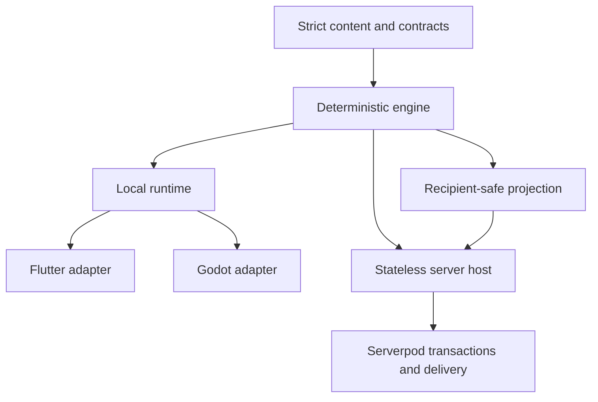

# ADR 0008: Engine Ownership

- Status: Accepted
- Date: 2026-08-22
- Implementation: Implemented

## Context

Flutter, Godot, strategic AI, replay, and multiplayer must observe the same
game rules. Allowing a client or transport to own part of canonical state would
make results depend on the selected frontend and would weaken replay,
recipient privacy, and server recovery.

## Decision

The Rust workspace under `engine/` is the only authoritative gameplay
implementation.



- Canonical maps, state, commands, queries, turn processors, AI, outcome,
  save, and replay semantics are owned by engine crates.
- Every transition is deterministic from explicit state, command, content, and
  trusted context. Pure crates do not read clocks, system randomness, I/O, or
  presentation state.
- Recipient projection is rules-sensitive engine policy. Clients never receive
  canonical hidden state and never reconstruct it from visible data.
- The local runtime owns session revisioning and lifecycle. The Serverpod host
  is stateless and evaluates a complete transition inside the database-owned
  transaction flow.
- Flutter widgets, Flame components, GDScript, native adapters, and Serverpod
  endpoints may validate transport shape but may not decide gameplay legality,
  cost, pathfinding, combat, fog, or outcome.
- One running session has one build, contract, and content identity. An identity
  mismatch fails closed.
- Versions are introduced for real independently deployed protocols or durable
  formats, not to label internal implementation phases.

## Consequences

All clients share behavior and replay evidence, while adapters remain thin and
replaceable. Engine changes must update every affected contract consumer in the
same repository change. Transport availability cannot be used as a gameplay
fallback.

## Verification

```sh
make engine-quality-check
make engine-client-test
make godot-check
make server-test
```

## Related Decisions And Documentation

- [ADR 0003: Command Boundaries](0003-command-boundaries.md)
- [ADR 0004: Versioned Multiplayer Protocol](0004-versioned-multiplayer-protocol.md)
- [ADR 0012: Flame Renderer For Flutter](0012-flame-renderer-for-flutter.md)
- [ADR 0013: In-Process Engine Host For Multiplayer](0013-in-process-engine-host-for-multiplayer.md)
- [Engine quality](../engine-quality.md)
