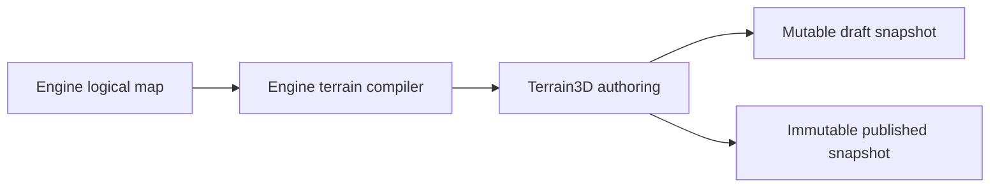

# ADR 0010: Terrain Backend For Godot Authoring

- Status: Accepted
- Date: 2026-08-22
- Implementation: Implemented

## Context

The Godot client needs terrain that designers can sculpt and texture after
importing a logical AoNW map. Maintaining region storage, terrain painting,
scalable level of detail, brush history, and import/export tooling in AoNW
would duplicate a complete terrain editor.

Terrain3D 1.0.2 provides editor authoring, region resources, float heightmaps,
raw R16 import with an explicit range, and terrain level of detail. Godot 4.7.1
tests also prove region persistence, undo/redo, CPU ray intersection, and
alignment of reference and grid points to edited heights.

## Decision

Terrain3D is the only terrain backend for the Godot client:

- The repository vendors the reviewed `v1.0.2-stable` addon, native libraries,
  MIT license, source archive identity, SHA-256, and the reviewed headless
  display-scale patch under `clients/aonw_godot/addons/terrain_3d/`.
- The project keeps the plugin enabled. `make godot-check` fails when the addon
  identity, required files, native extension, or runtime classes differ.
- The desktop client uses Forward+ rendering. Terrain3D world background is
  disabled so only imported map regions are rendered.
- Imported maps persist height and paint data as Terrain3D regions. Mutable
  working regions are copied into hash-addressed verified snapshots; draft and
  published collections are separate.
- The authoring session depends directly on `Terrain3DData`, applies compiled
  authoring limits, and participates in Godot undo/redo. There is no second
  terrain-backend abstraction.
- Reference artwork, the hex grid, and picking sample the deformed Terrain3D
  surface. One terrain-space transform converts logical hex, absolute world,
  raster, and Terrain3D-local coordinates.
- Logical terrain, movement, yields, commands, and gameplay rules remain in the
  engine. Terrain3D and GDScript own authoring and presentation only.

Ordinary meshes may represent overlays, models, and editor helpers, but not a
second playable terrain surface.

## Consequences

Designers get native sculpting, texture painting, region persistence, and LOD
without AoNW maintaining equivalent tooling. The repository carries a reviewed
native dependency, so updates require an explicit compatibility and license
review.

Godot can print shutdown-only `EditorDock` and icon resource-leak diagnostics
when a headless editor terminates immediately after unloading Terrain3D. The
suite must still exit successfully and the runtime contract must stay clean.
Re-evaluate those diagnostics on every Godot or Terrain3D update; they never
justify a fallback renderer.

## Updating Terrain3D

1. Download the reviewed official stable archive and verify its SHA-256.
2. Replace the vendored addon while preserving only reviewed project patches.
3. Update `.aonw-install` with the version, archive, digest, source, license,
   and patch identity.
4. Run `make godot-check` on every supported editor platform.
5. Review GDExtension compatibility, region persistence, EXR/R16 behavior,
   undo/redo, overlays, picking, and the upstream license before committing.

Restoring an earlier version means restoring the complete addon and marker
together. Existing authored regions must pass that version's headless suite.

## Verification

`make godot-check` verifies the vendored identity marker, plugin version,
license, native extension, runtime assets, and Rust adapter. Its Godot suites
exercise EXR and R16 import, bounded region save/load, publication, metadata,
undo/redo, overlay alignment, artifact identity, draft reopen, non-zero world
origins, transformed reference draping, picking, maps, runtime scenes, camera,
controls, and multiplayer composition.

## Related Decisions And Documentation

- [ADR 0008: Engine ownership](0008-engine-ownership.md)
- [ADR 0011: Logical map workbench and generation](0011-logical-map-workbench-and-generation.md)
- [Godot client](../../clients/aonw_godot/README.md)
- [Engine quality](../engine-quality.md)
- [Terrain3D v1.0.2-stable](https://github.com/TokisanGames/Terrain3D/releases/tag/v1.0.2-stable)

## Rejected Alternatives

- Building a separate terrain editor with custom sculpting, painting, region
  persistence, and LOD.
- Keeping Terrain3D optional and falling back to another terrain surface.
- Downloading the native addon during each local or CI run.
