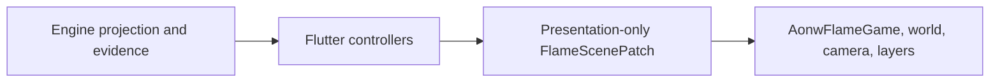

# ADR 0012: Flame Renderer For Flutter

- Status: Accepted
- Date: 2026-08-23
- Implementation: Implemented

## Context

The Flutter client needs one explicit world and camera lifecycle, stable visual
component identity, efficient map rendering, unified input, and presentation
effects that do not become a second source of gameplay rules.

## Decision

Flame is the only renderer for the Flutter gameplay viewport.



- Flutter owns the application shell, routing, HUD, forms, dialogs,
  localization, focus, semantics, and accessibility.
- Flame owns the gameplay viewport: world and camera lifecycle, map layers,
  picking, visual component identity, animation, and VFX.
- Flame components receive immutable presentation models and emit
  framework-neutral intents. They do not receive repositories, FFI sessions,
  wire DTOs, or domain commands.
- Engine state changes are converted to `FlameScenePatch`; animations are
  optional presentation and never dispatch authoritative commands on
  completion.
- Keyboard, pointer, wheel, touch, and gamepad input converge on the same
  application intents. Dialogs and full-screen routes retain input ownership.
- The reviewed dependency baseline is Flame `1.38.0` and `flame_test 2.3.0`,
  resolved by the client lockfile.

Forge2D, `flame_tiled`, per-hex collision bodies, and a second application
router remain outside this decision unless measured requirements justify a new
ADR.

## Consequences

The map has one renderer and one camera state. Gameplay authority remains
outside Flutter and Flame. Renderer upgrades require dependency review, visual
and accessibility tests, a real-native smoke, and the pinned device performance
gate.

## Verification

```sh
make flutter-client-check
make flutter-client-performance-check
make engine-client-test
```

## Related Decisions And Documentation

- [ADR 0008: Engine Ownership](0008-engine-ownership.md)
- [Flutter client README](../../clients/aonw_flutter/README.md)
- [Performance benchmarks](../performance-benchmarks.md)
