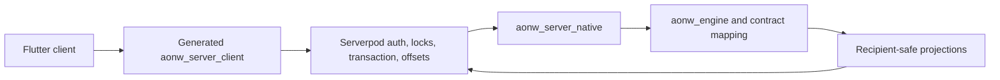

# ADR 0013: In-Process Engine Host For Multiplayer

- Status: Accepted
- Date: 2026-08-29
- Implementation: Implemented

## Context

Authenticated multiplayer needs durable command correlation, transactionality,
recipient-safe projections, reconnect, and exact resynchronization. Serverpod
already owns the transport and database lifecycle, while gameplay decisions
must remain identical to local sessions.

## Decision

Serverpod calls one stateless, in-process Rust host for every authoritative game
transition.



- `packages/aonw_server_client` is the single generated auth and game client.
- Serverpod derives the actor from the authenticated session. Player payloads
  carry no trusted actor identity.
- Serverpod owns matchmaking, locks, transactions, idempotency, durable event
  offsets, post-commit delivery, reconnect, and operational telemetry.
- The engine owns validation, rules, rejection precedence, deterministic
  transitions, events, evidence, digests, and recipient projection.
- The host is stateless and reentrant. Each call receives a strict bounded
  canonical state, immutable content, trusted context, and one command or
  system transition; it returns an all-or-nothing outcome.
- The host calls engine and projection crates directly. It does not open a local
  client session or use the Flutter/Godot ABI.
- Gameplay documents crossing Dart are opaque except for transport metadata
  needed for correlation, audience, offset, and delivery.
- Payload bounds, panic containment, native build identity, and startup
  verification fail closed.
- A sidecar or alternate gameplay backend is not maintained in parallel.

## Consequences

Local and online play share one rules implementation. Serverpod can retry and
recover transport transactions without reproducing canonical state logic.
Deployments must package the exact native artifact expected by the server and
clients.

## Verification

The integration suite covers authenticated actor ownership, duplicate and
out-of-order commands, rollback on internal error, exact offsets, process
restart, recipient privacy, reconnect, and resync.

```sh
make server-test
make server-integration-test
make server-native-test
```

## Related Decisions And Documentation

- [ADR 0003: Command Boundaries](0003-command-boundaries.md)
- [ADR 0004: Versioned Multiplayer Protocol](0004-versioned-multiplayer-protocol.md)
- [ADR 0008: Engine Ownership](0008-engine-ownership.md)
- [Multiplayer protocol](../multiplayer-protocol.md)
